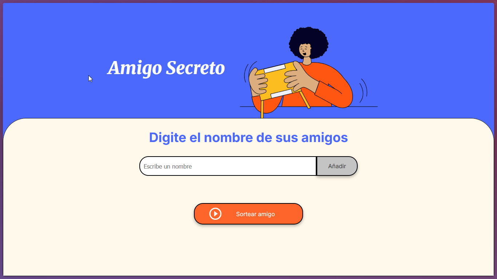

# Amigo Secreto

Este proyecto es una aplicación sencilla para sortear un "amigo secreto" entre una lista de nombres.

## Funcionalidades

- **Agregar amigos:**  
  Escribe el nombre de un amigo en el campo de texto y haz clic en "Añadir" para agregarlo a la lista.

- **Mostrar lista de amigos:**  
  Los nombres agregados se muestran en una lista en pantalla.

- **Sortear amigo secreto:**  
  Haz clic en el botón "Sortear amigo" para seleccionar aleatoriamente un nombre de la lista y mostrarlo como el amigo secreto.

- **Validaciones:**
  - No se puede agregar un nombre vacío.
  - No se puede sortear si la lista está vacía.

## Cómo usar

1. Abre el archivo `index.html` en tu navegador.
2. Agrega los nombres de tus amigos.
3. Haz clic en "Sortear amigo" para ver el resultado.

## Video demostración

